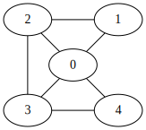

# Plan
I model these 5 unknown numbers as nodes in a graph.

Let it be edgeless initially.
I will add 7 directed edges to the graph by comparing 7 pairs of distinct nodes.
If `x > y`, then there is a edge `x -> y`.

My goal is to find a undirected graph of 5 nodes with 7 edges, such that:
For any case of the value permutations, after the edges is converted to directed by comparison on their adjacent nodes,
enough information can be derived from the graph to compare any two nodes IFF (if `x > y` there is a path `x → y`, and if `x < y` there is NO path `x → y`)

A complete graph of 5 nodes has (5*(5-1)/2 = 10) edges.
(10 select 7) = 120 cases.
The full permutation of 5 distinct elements = 5! = 120 cases.
- [ ] permit equal numbers

# result
```
found: 20
(0, 1) (0, 2) (0, 3) (0, 4) (1, 2) (2, 3) (3, 4)
```


[^src](https://dreampuf.github.io/GraphvizOnline/#graph%20%7B%0A%20%20%20%200%20--%201%3B%0A%20%20%20%200%20--%202%3B%0A%20%20%20%200%20--%203%3B%0A%20%20%20%200%20--%204%3B%0A%20%20%20%201%20--%202%3B%0A%20%20%20%202%20--%203%3B%0A%20%20%20%203%20--%204%3B%0A%7D%0A)
